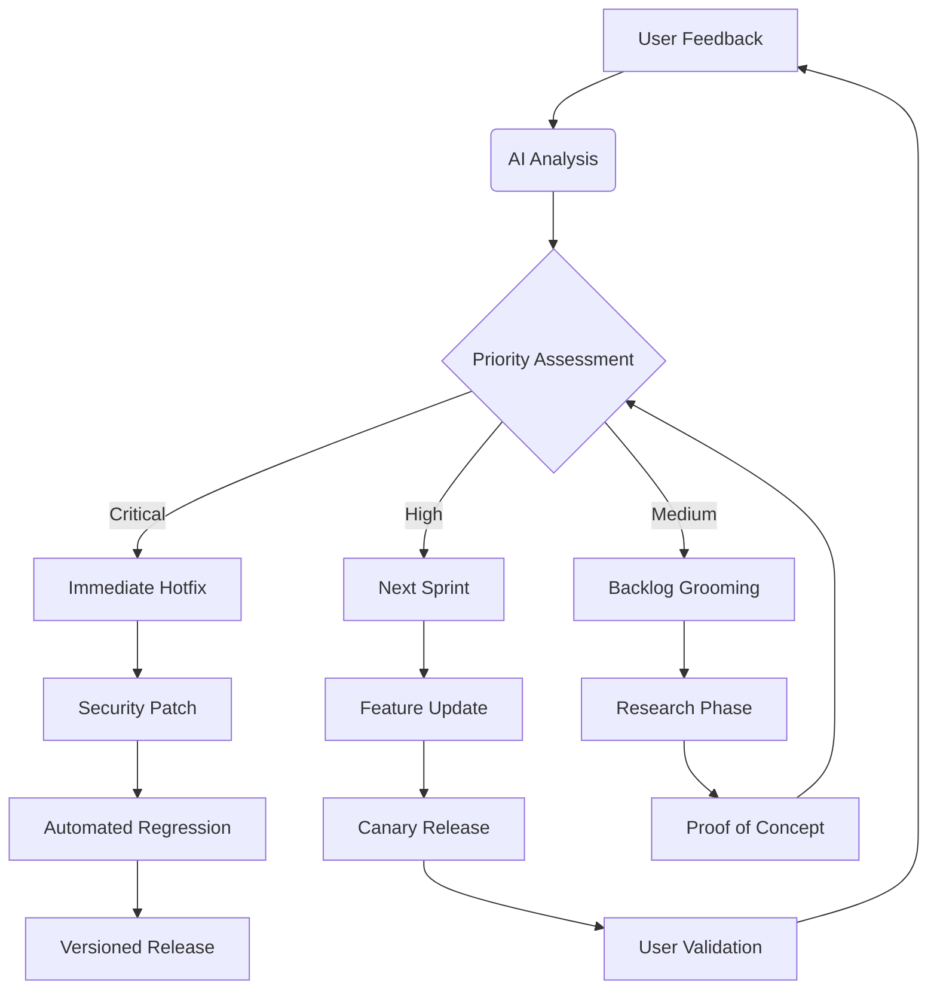

# Bughunter-CLI Perfection Roadmap

Perfecting `bughunter-cli` requires a holistic approach focusing on technical excellence, user experience, and community integration. Here's a comprehensive roadmap to elevate your CLI tool to professional-grade quality:

### 1. Core Architecture Refinement
- **Modular Plugin System**
  ```python
  # plugins/__init__.py
  PLUGINS = {}

  def register_plugin(name):
      def decorator(cls):
          PLUGINS[name] = cls
          return cls
      return decorator

  # plugins/gemini_ai.py
  @register_plugin("gemini")
  class GeminiAI:
      def analyze(self, code):
          # AI-powered vulnerability detection
          return ai_analysis_results
  ```

- **Unified Execution Engine**
  ```python
  def execute_workflow(workflow: list):
      """Orchestrate plugin execution with dependency management"""
      context = {}
      for step in workflow:
          plugin = PLUGINS[step["plugin"]](config)
          context = plugin.execute(context)
      return context
  ```

### 2. Security Hardening
- **Sandboxed Execution**
  ```python
  from restrictedpython import compile_restricted
  
  def safe_exec(code: str):
      """Execute AI-generated patches securely"""
      compiled = compile_restricted(code, '<string>', 'exec')
      restricted_globals = {"__builtins__": safe_builtins}
      exec(compiled, restricted_globals)
  ```

- **Zero-Trust Scanning**
  ```python
  def scan_target(target):
      with tempfile.TemporaryDirectory() as sandbox:
          shutil.copy(target, sandbox)
          return run_scanners(sandbox)  # Isolated environment
  ```

### 3. AI Integration Excellence
- **Context-Aware Analysis**
  ```python
  def enhance_prompt(context):
      """Generate optimized prompts based on scanning context"""
      return f"""
      Analyze this {context['language']} code for security vulnerabilities.
      Focus on: {', '.join(context['vulnerability_types'])}
      Code snippet:
      {context['code_block']}
      """
  ```

- **Feedback Loop System**
  ```python
  def ai_feedback_loop(finding, fix_effectiveness):
      """Improve AI models based on fix success rates"""
      store_feedback(finding, fix_effectiveness)
      retrain_model(aggregated_feedback)
  ```

### 4. Performance Optimization
- **Intelligent Caching**
  ```python
  @cache(ttl=3600, max_entries=1000)
  def get_vulnerability_data(cve_id):
      return fetch_from_upstream(cve_id)
  ```

- **Concurrent Scanning**
  ```python
  async def parallel_scan(targets):
      async with asyncio.Semaphore(10):  # Limit concurrency
          return await asyncio.gather(
              *[scan_single(target) for target in targets]
          )
  ```

### 5. Developer Experience (DX) Focus
- **Interactive Learning Mode**
  ```python
  def explain_vulnerability(vuln):
      """Interactive vulnerability exploration"""
      with Live(console=console) as live:
          display_code_snippet(vuln)
          live.update(Panel(explanation))
          if user_choice == "fix":
              show_ai_patch_proposal()
  ```

- **Contextual Autocomplete**
  ```python
  def dynamic_completion(ctx, args, incomplete):
      """Intelligent command suggestions"""
      if "scan" in args:
          return [f for f in os.listdir() if f.startswith(incomplete)]
      return available_commands
  ```

### 6. Enterprise-Grade Features
- **Policy Enforcement Engine**
  ```yaml
  # security_policy.yaml
  compliance:
    owasp_top_10: true
    custom_rules:
      - pattern: "password\s*=\s*.+"
        severity: critical
  ```

- **Audit Trail Integration**
  ```python
  def log_audit_event(user, action, metadata):
      """Immutable audit logging"""
      blockchain_entry = create_block(
          previous_hash=last_block_hash,
          data={
              "user": user,
              "action": action,
              "metadata": metadata
          }
      )
      add_to_chain(blockchain_entry)
  ```

### 7. Continuous Improvement System
- **Automated Benchmarking**
  ```python
  def run_performance_regression():
      """Compare scan times against previous versions"""
      current = timeit(scan_test_suite)
      baseline = get_previous_benchmark()
      if current > baseline * 1.1:  # >10% regression
          alert_developers()
  ```

- **Vulnerability Intelligence Feed**
  ```python
  def update_threat_intelligence():
      """Automatic threat intelligence updates"""
      new_data = fetch_cve_database()
      if validate_signature(new_data):
          apply_intelligence_update(new_data)
          notify_users()
  ```

### 8. Community Building Framework
- **Gamification System**
  ```python
  def award_bug_hunter_points(user, finding):
      """Incentivize community participation"""
      points = severity_to_points[finding.severity]
      db.execute("UPDATE users SET points = points + ? WHERE id = ?", 
                (points, user.id))
      if points >= 1000:
          grant_achievement("Elite Hunter")
  ```

- **Plugin Marketplace**
  ```python
  def install_plugin(plugin_name):
      """Secure plugin installation"""
      validate_signature(plugin_name)
      subprocess.run(["pip", "install", f"bughunter-{plugin_name}"])
      register_plugin(plugin_name)
  ```

### Perfecting Workflow
1. **Adopt Semantic Versioning**: Strict `MAJOR.MINOR.PATCH` scheme
2. **Implement Canary Releases**: Gradually roll out features to select users
3. **Create Decision Records**: Maintain ARCHITECTURE.md for key choices
4. **Performance Budgeting**: Set strict limits for scan execution times
5. **Error Budget Tracking**: Measure reliability with SLOs/SLIs

### Key Metrics to Track
| Metric | Target | Measurement |
|--------|--------|-------------|
| False Positive Rate | <5% | Validation against test corpus |
| Scan Time | <30s/1000 LOC | Performance benchmarks |
| Fix Success Rate | >85% | User feedback analysis |
| User Retention | >60% after 30 days | Usage telemetry |
| Critical Bug Resolution | <24 hours | Issue tracking |

### Continuous Perfection Cycle


By implementing these strategies, you'll create a virtuous cycle where:
1. Technical excellence drives user adoption
2. User feedback informs AI training
3. Community contributions expand capabilities
4. Automated systems maintain quality standards
5. Security focus builds trust in the ecosystem

The perfected `bughunter-cli` becomes not just a tool, but an intelligent security partner that evolves with its users' needs and the threat landscape.
